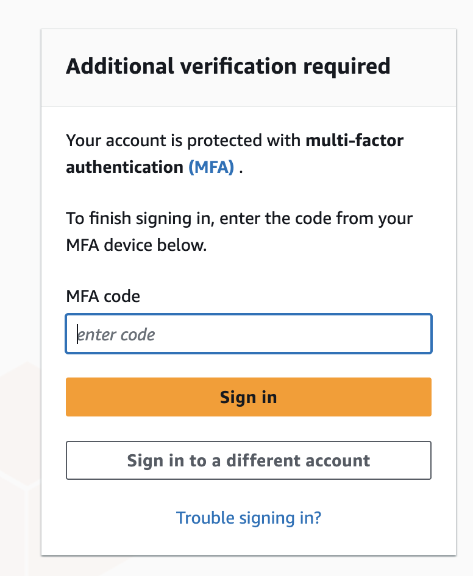
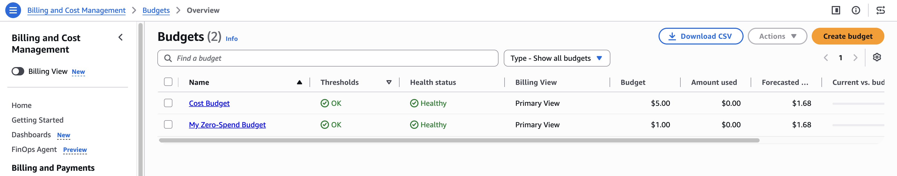

## Lab 1 — Secure Your AWS Account

## Why do we use MFA over password

"If my root password leaks — reused from another breached site, phished, whatever — MFA stops the login anyway, because the attacker also needs my physical device generating the one-time code. Password alone being correct is no longer sufficient to get in."

Two facts: (1) name the leak vector, (2) name what MFA forces the attacker to also possess.

Goal: Create a safe AWS account foundation for the next 10 weeks.

Steps:

1. Create or log in to your AWS account.
2. Enable MFA on the root user.
   
3. Open the Billing Dashboard.
4. Turn on billing alerts / budget alerts.
   Billing and Cost Management -> Budget -> Create Budget
5. Create an alert for estimated charges, for example `$5`.
   
6. Stop using root user for daily activities.

Deliverables:

- Screenshot of root MFA enabled.
- Screenshot of billing alert or budget alert.
- Short note explaining why root user should not be used daily.

Security note:

Do not share root email, account ID, access keys, secret keys, MFA QR code, payment details, or detailed billing information in screenshots.
